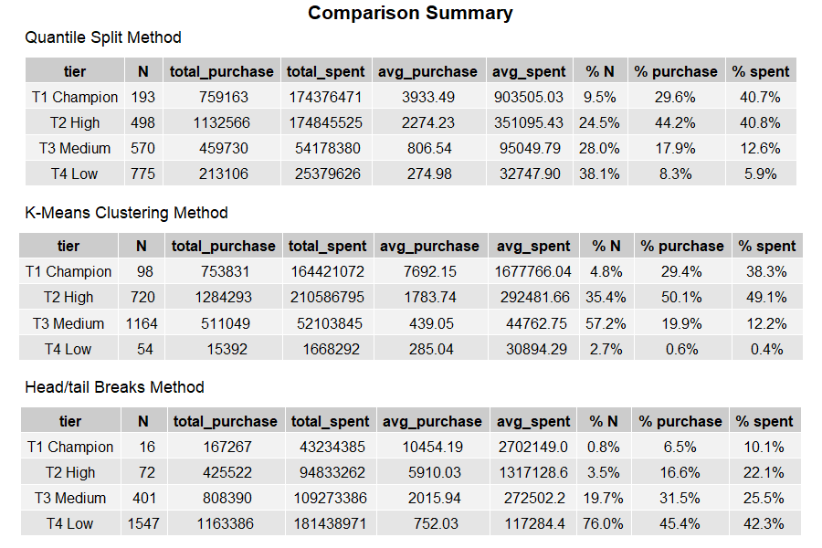

# What’s the Best Way To Segment Users Based on Consumer Behavior: Quantile Split, K-Means, or Head/Tail Breaks?


*Illustration asset by [Anna Dziubinska](https://unsplash.com/@annadziubinska?utm_source=unsplash&utm_medium=referral&utm_content=creditCopyText) on [Unsplash](https://unsplash.com/photos/mVhd5QVlDWw?utm_source=unsplash&utm_medium=referral&utm_content=creditCopyText)*

## Table of Content

* [User Segmentation](#user-segmentation)
    + [Method](#method)
    + [RFM Segmentation](#rfm-segmentation)
* [The Head/tail Breaks Method](#the-head-tail-breaks-method)
    + [Algorithm](#algorithm)
* [Method Comparison](#method-comparison)
    + [Data for Case Study](#data-for-case-study)
    + [Creating RFM Table](#creating-rfm-table)
    + [Overview](#overview)
    + [Main Analysis](#main-analysis)
      - [The Quantile Split Method](#--the-quantile-split-method--)
      - [The K-Means Clustering Method](#the-k-means-clustering-method)
      - [The Head/tail Breaks Method](#the-head-tail-breaks-method-1)
    + [Comparison Summary](#comparison-summary)
* [Conclusion](#conclusion)
* [References](#references)

---

## User Segmentation

User segmentation is a way that businesses divide up groups of people who might be interested in buying their products. User segmentation is important for businesses because it helps them understand their customers better. When a company knows more about its customers, it can create products and services that people are more likely to want to buy. It also helps the company create marketing campaigns that will appeal to different groups of people. To extend, it can also create a personalized advertising approach to individual customers. A good user segmentation should follow a hierarchical pattern, meaning the proportion of higher classes should be fewer than the lower classes.

### Method

There are many ways to do user segmentation, but here are some methods that are common to most companies:

- **Demographic**: divides people into groups based on their age, gender, income, education level and other things like that
- **Geographic**: divides people into groups based on where they live, like their city, state, or country
- **Behavioral**: divides people into groups based on how they behave, like their shopping habits or the types of products they buy

Other methods may include psychographic, firmographic, technographic, and customer data [1]. There is also a method that is popular, easy to use, and said to be an effective segmentation method called RFM segmentation. This method relies on customers’ transaction behavior to define its segments [2].

### RFM Segmentation

RFM stands for Recency, Frequency, and Monetary value (or just Monetary), these three key factors are used to create the segmentation. 

- **Recency**: measures how recently a customer has made a purchase, customers who have made a purchase more recently are more likely to be engaged with the company and may be more receptive to marketing messages
- **Frequency**: measures how often a customer makes purchases (in a certain period), customers who make purchases more often are more likely to be loyal to the company and may be more valuable in the long term
- **Monetary value**: measures how much a customer spends (in a certain period), customers who spend more money are more valuable to the company and may be worth more effort to retain

***So how can these variables define segments?***

There are many methods to analyze the RFM variables, the most common method is quantile split. It divides each variable into tiered groups sized equally to each other. There are also more sophisticated and less manual approaches like k-means clustering analysis.

***Are the existing methods good?***

It depends. If you are seeking convenience, the answer is that those methods are pretty easy to use and practical. But, does the result meet the expectation? The answer to this question is no. Quantile split tends to create equal-sized groups that do not reflect user segmentation's hierarchical property. On the other hand, k-means clustering’s results can be different for each iteration, since its starting points are usually chosen at random.

## The Head/tail Breaks Method

The Head/tail Breaks method (Jiang, 2013) is a data classification scheme that is optimized for heavy-tailed distribution data. It groups the data values into two parts around the arithmetic mean and continues the partitioning for values above the mean iteratively until the head part values are no longer heavy-tailed distributed [3]. A scaling or hierarchy pattern is a particular pattern that underlies the heavy-tailed distribution. Since user segmentation is a hierarchical classification, then it is expected to have a hierarchy pattern, thus it is most likely to be heavy-tailed distributed implying that this method may perform better.

### Algorithm

This is the simplified algorithm that originated from [3]. It said that the class intervals and the number of classes are naturally determined by the data, so I made a little modification to simplify the algorithm by adding a “stopping” mechanism rather than an uncountable looping sequence. My “stopping” mechanism is a parameter `k`, it is the number of classes that must be created in such the loop (inside the algorithm) will always stop at `k-1`.

1. Calculate the arithmetic mean of the original data
2. Identify where each data values belong to: less than or higher than the arithmetic mean
3. Calculate the arithmetic mean for the group of data that has fewer member than the others
4. Repeat steps 2 and 3 until the current data is no longer heavy-tailed distributed or completed the requested iteration

## Method Comparison

In this research, I will compare methods for analyzing RFM variables: quantile split, k-means, and head/tail breaks. A good classification method should largely reflect the pattern that implies the data [3]. As mentioned earlier, user segmentation is meant to follow a hierarchical pattern, thus head/tail breaks method may suggest better results than the others.

### Data for Case Study

I’m using Google BigQuery public dataset [Iowa Liquor Sales](https://console.cloud.google.com/marketplace/details/iowa-department-of-commerce/iowa-liquor-sales)’ sales table, some variables that are going to be used include:

- `store_number`: a unique number assigned to the store that ordered the liquor (unique identifier of each customer)
- `date`: date of order (to calculate Recency)
- `invoice_and_item_number`: concatenated invoice and line number associated with the liquor order (to calculate Frequency)
- `sale_dollars`: total cost of liquor order (to calculate Monetary value)

### Creating RFM Table

Here is how I created the RFM variables that I needed from Google BigQuery (SQL):

**Frequency and monetary table**
The frequency and monetary value variables are the easiest to calculate since both are straightforward calculations.

```sql
SELECT
  store_number,
  COUNT(DISTINCT invoice_and_item_number) AS frequency,
  SUM(sale_dollars) AS monetary_value
FROM
  `bigquery-public-data.iowa_liquor_sales.sales`
WHERE
  date BETWEEN '2022-01-01'
  AND '2022-12-31'
GROUP BY
  1
```


**Recency table**
The recency variable is kind of tricky as it can not be calculated directly. So this table is the halfway method of calculating recency.

```sql
SELECT
  store_number,
  MAX(date) AS last_trx
FROM
  `bigquery-public-data.iowa_liquor_sales.sales`
WHERE
  date BETWEEN '2022-01-01'
  AND '2022-12-31'
GROUP BY
  1
```


**Combining above tables**
To combine those tables, I used CTE to temporarily save the two tables and used them later in the main query. Note that the period of interest is 2022 and the unit of recency is `day`.

```sql
WITH
  t0 AS (
  SELECT
    *
  FROM
    `bigquery-public-data.iowa_liquor_sales.sales`
  WHERE
    date BETWEEN '2022-01-01'
    AND '2022-12-31' ),
  t1 AS (
  SELECT
    store_number,
    COUNT(DISTINCT invoice_and_item_number) AS frequency,
    SUM(sale_dollars) AS monetary_value
  FROM
    t0
  GROUP BY
    1 ),
  t2 AS (
  SELECT
    store_number,
    MAX(date) AS last_trx
  FROM
    t0
  GROUP BY
    1 )
SELECT
  t1.store_number,
  DATE_DIFF('2022-12-31', t2.last_trx, DAY) AS recency,
  t1.frequency,
  t1.monetary_value
FROM
  t1
INNER JOIN
  t2
USING
  (store_number)
ORDER BY
  t1.store_number
```


### Overview

For the analysis, I am using R Studio instead of Google BigQuery for convenience.

```r
glimpse(rfm_table)
#> Rows: 2,036
#> Columns: 4
#> $ store_number   <int> 10003, 10004, 10005, 10016, 10017, 10018, 10019, 10020,~
#> $ recency        <int> 4, 4, 4, 15, 10, 32, 3, 1, 2, 16, 12, 30, 1, 2, 11, 2, ~
#> $ frequency      <int> 791, 196, 1033, 191, 177, 204, 470, 885, 658, 128, 211,~
#> $ monetary_value <dbl> 76617.08, 26655.33, 88891.35, 23576.59, 23028.17, 27072~
```

There are 2036 unique customers that transacted during 2022.


At a glimpse, all of the RFM variables’ distribution are long-tailed distributed, but there is somewhat of a different pattern in the Recency. Long-tailed distribution is a subclass of heavy-tailed distribution [4], this finding may be important for additional insight. To further investigate, I plotted the same distribution using the `log10` transformation. 


Both Frequency and Monetary variables are shown to become a bell-shaped distribution under the logarithm transformation, it implies that those variables are heavy-tailed distributed. On the other hand, the Recency variable is kind of different from the others and does not look like follows any common distribution.

From this graphical exploration, I concluded that RFM variables have the hierarchy pattern property as user segmentation classes should have.

### Main Analysis

For convenience, I will only create 4 user segments named Champion, High, Medium, and Low ordered by their monetary value (from highest to lowest) consecutively.

#### The Quantile Split Method

This method split each RFM variable into equally-sized groups using its quantile values as class intervals. 


Each interval is then coded as the number 1 to 4 which reflects which interval they belong. For Recency, the bigger the value the code will be bigger as well, however, for Frequency and Monetary, the converse is applied.


For the scoring, I used average to calculate the average of recency, frequency, and monetary score combined. There are many other alternatives on how to score, such as summation. To assign the segment name or `tier`, I used the following rule:

| Score | Tier |
| --- | --- |
| Exactly 1 | Champion |
| 1 < score ≤ 2  | High |
| 2 < score ≤ 3 | Medium |
| More than 3 | Low |

Note there is no strict rule on segment name ruling and most likely to be customized to each business.

#### The K-Means Clustering Method

In this method, the classes will be obtained from the k-means clustering results. To ensure that the determined number of classes (k=4) is good, I checked the Within Sum of Square (WSS aka Elbow method) and Silhouette value.


Based on the above plot, as the number on which the elbow point and the highest Sil value are shown, the number of classes (k=4) suggests a good result.

The clustering results are then labeled using the prepared segment name, ordered by the average monetary value of each cluster.


Finally, apply the result to the original table.


#### The Head/tail Breaks Method

For this method, the Head/tail Breaks are applied to each RFM variable and the results are then used for profiling each segment. Here I also used the same coding, scoring, and name ruling as the quantile split method.


Then, apply the bin intervals to the RFM table.


### Comparison Summary

Here are the summary of each method segments’ profile:



First of all, the **Quantile Split** method results show a hierarchy pattern on its segments’ member count. However, there is no significant difference between each segment which leads to a bad differentiation between the segments. This result is expected to occur since the quantile method split each RFM variable into equal-sized groups beforehand.

Secondly, the **K-Means Clustering** method results show no hierarchy pattern, as the lowest tier (named T4 Low) has the lowest member count instead. Although the same algorithm to define segment name is applied (by ordering monetary descending), the result suggests a “poor” classification judging by its segment results' inconsistency properties.

Lastly, the **Head/tail Breaks** method results show a better hierarchy pattern than the other methods. The proportion of each group member count suggests good differentiation as the lowest tier includes 76% of the entire customers while the highest tier is only assigned to only 0.8% of customers. Proper and consistent ordering in each property of the segments also supports the results as good results.

## Conclusion

User segmentation is important for businesses as it can improve their marketing strategies and ultimately increase their sales and revenue. One common and popular way to segment users is using RFM metrics. Considering customers' transaction behavior, especially their last transaction activity, purchase frequency, and the total spent, marketers can create segments of customers that have similar traits. 

Three approaches were tried to find the best method to analyze RFM metrics, and the result found is the Head/tail Breaks method suggests better results than quantile split and k-means clustering method. The Head/tail Breaks classified customers into segments that have a good differentiation between each segment and also show a decent hierarchical pattern. Although this method has been established a decade ago, it seems this method has not found many places in business practices. I hope that this research gives the readers insights and inspiration, especially to learn and implement the Head/tail Breaks in real-world applications.

***So, are you interested to use apply this method to your business practices? :)***

---

## References

[1] Pendo. "What is user segmentation? | pendo.io." Pendo.io. [https://www.pendo.io/glossary/user-segmentation/](https://www.pendo.io/glossary/user-segmentation/) (accessed Apr. 10, 2023).

[2] P. Makhija. "RFM analysis for customer segmentation." CleverTap - App Analytics and Mobile User Engagement. [https://clevertap.com/blog/rfm-analysis/](https://clevertap.com/blog/rfm-analysis/) (accessed Apr. 10, 2023).

[3] B. Jiang, "Head/Tail breaks: A new classification scheme for data with a heavy-tailed distribution," *Professional Geographer*, vol. 65, no. 3, pp. 482–494, Aug. 2013. Accessed: Apr. 13, 2023. [Online]. Available: [https://doi.org/10.1080/00330124.2012.700499](https://doi.org/10.1080/00330124.2012.700499)

[4] R. Wicklin. "Fat-tailed and long-tailed distributions." SAS Blogs. [https://blogs.sas.com/content/iml/2014/10/13/fat-tailed-and-long-tailed-distributions.html](https://blogs.sas.com/content/iml/2014/10/13/fat-tailed-and-long-tailed-distributions.html) (accessed Apr. 17, 2023).
